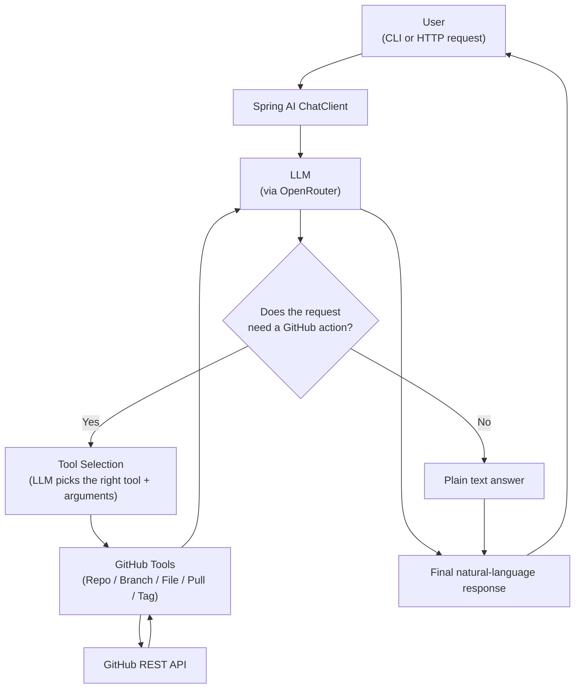
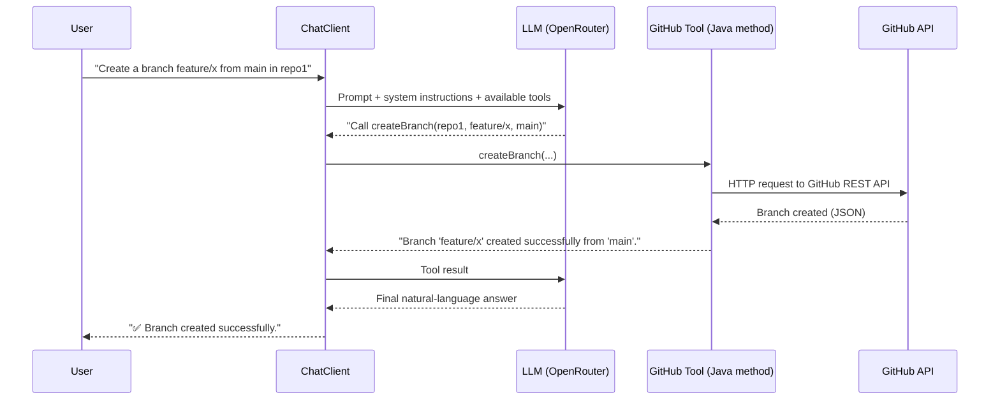
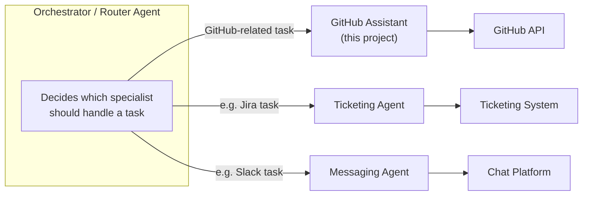

# GitHub Assistant — Spring AI Agent

A Spring Boot application that lets you manage GitHub repositories using **plain English**, instead of Git commands or REST calls.

You type something like:

> "Create a branch called `feature/login` from `main` in `payments-service`"

...and the assistant figures out which GitHub operation to run, calls the GitHub API, and reports back what happened.

It's built with [Spring AI](https://spring.io/projects/spring-ai) and demonstrates a clean, practical **tool-calling agent**: an LLM that doesn't just chat, but takes real actions on a real system.


---

## What it does

The assistant understands natural-language requests and can:

- List, create, and delete **repositories**
- Create, list, and delete **branches**
- Create or update **files** in a repository
- Open and **merge pull requests**
- Create **tags** (e.g. release tags)

It only performs actions it actually has a tool for. If you ask for something it can't do (like deleting a single file), it tells you plainly instead of guessing or running the wrong operation.

You can talk to it two ways:
- An **interactive CLI** (type requests in the terminal)
- A **REST API** (send requests from any HTTP client)

---

## Architecture

At a high level, every request flows through the same pipeline, whether it comes from the CLI or the REST API:



**In plain terms:** the LLM never talks to GitHub directly. It decides *what* needs to happen and *which tool* should do it. The tool is a regular Java method that calls the GitHub API and returns a plain-text result. The LLM then turns that result into a friendly response.

---

## How you interact with it

### 1. CLI (Command Line)

Run the app and a REPL-style prompt starts in your terminal. You type requests, the assistant responds, and it remembers the conversation so you can ask follow-up questions.

```
=========================================
 GitHub Assistant CLI
 Type a natural-language GitHub request and press Enter.
 Type 'help' for commands, 'exit' or 'quit' to exit.
 Examples: 'List all repositories' or 'Create a branch called feature/test from main in repo1'
=========================================

> List all repositories

⏳ Thinking...

----- AI response -----
Repository: payments-service
URL: https://github.com/your-org/payments-service
Default branch: main
-----------------------

----- Token usage -----
Input tokens: 812
Output tokens: 46
Total tokens: 858
-----------------------
```

Type `help` to see available commands, or `exit` / `quit` to leave.


### 2. REST API

The same assistant is exposed as an HTTP endpoint, so it can be called from Postman, curl, another service, or a UI.

**Endpoint:** `POST /chat`
**Content-Type:** `text/plain`
**Body:** your request, as plain text

```bash
curl -X POST http://localhost:3142/chat \
  -H "Content-Type: text/plain" \
  -d "Create a repository called demo-service that is public"
```

The response is a plain-text natural-language answer describing what happened (e.g. the new repo's URL).

> Note: the REST endpoint currently handles each request independently — conversation memory (see below) is wired into the CLI, not yet into this endpoint.

---

## How the LLM and tools work together

This is the core idea of the project: the LLM never calls GitHub itself. It only chooses *which* tool to call and *with what arguments*. Spring AI executes the tool and feeds the result back to the model so it can produce a final answer.



Every tool method returns a simple, human-readable string — success or failure — so the model always knows exactly what really happened and never has to guess.


---

## Memory

The CLI keeps track of the ongoing conversation using Spring AI's **`MessageWindowChatMemory`**, capped at the last 20 messages. This means you can ask a follow-up question like *"now delete it"* and the assistant will know what "it" refers to, without you repeating the repository or branch name.

Each CLI session uses a fixed conversation ID, so memory persists for the lifetime of that CLI run.


---

## Advisors

Spring AI **advisors** are hooks that wrap around every call to the model. This project uses two:

| Advisor | Purpose |
|---|---|
| `MessageChatMemoryAdvisor` | Injects the conversation history into each request so the model has context (CLI only). |
| `ToolCallLoggingAdvisor` (custom) | Logs each request/response cycle to the console — which tool was called and with what arguments — useful for debugging and understanding the model's decisions. |

The custom advisor doesn't change the model's behavior; it's purely observational, printing the model's reasoning trail as the request happens.

---

## System prompt

The assistant is guided by a single, focused system prompt that keeps it honest and predictable:

- Only use a tool when the user actually asks for a GitHub operation.
- Never claim an action succeeded unless the tool confirms it.
- If there's no matching tool for a request, say so — don't silently substitute a different action (e.g. never delete a branch when asked to delete a file).

This keeps the assistant's behavior safe and explainable rather than "creative."


---

## GitHub operations supported

| Area | Operation | Description |
|---|---|---|
| **Repositories** | Create | Creates a new repository in the configured organization |
| | List | Lists all repositories with their URL and default branch |
| | Delete | Deletes a repository (only when explicitly requested) |
| **Branches** | Create | Creates a new branch from a given source branch |
| | List | Lists all branches in a repository |
| | Delete | Deletes a branch |
| **Files** | Create / Update | Creates a new file, or updates it if it already exists, on a given branch |
| **Pull Requests** | Create | Opens a pull request from a source branch into a target branch |
| | Merge | Merges an existing pull request |
| **Tags** | Create | Creates a tag (e.g. a release tag) pointing at a branch/commit |

Operations that are **not** currently supported (like deleting a single file) are explicitly called out by the assistant instead of being faked.

---

## Part of a larger multi-agent system

This project is intentionally self-contained, which makes it a good building block for a bigger system. Because it's exposed both as tools (in-process) and as a REST endpoint, it can act as a **specialized "GitHub agent"** that a larger orchestrator delegates to:



In practice, this means the GitHub tool classes (`RepoTools`, `BranchTools`, `FileTools`, `PullTools`, `TagTools`) can be reused directly inside another Spring AI `ChatClient`, or this whole service can be called over HTTP as one agent among several in a bigger workflow — e.g. "review this PR, then update the changelog, then notify the team" spanning multiple specialized agents.


---
